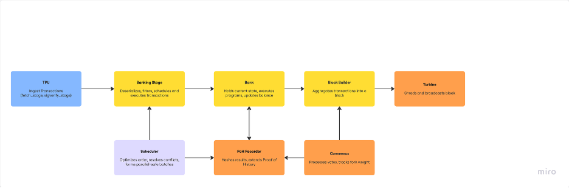

# Leader Phase in Agave Validator

---

## 1. What does a validator do when it becomes the leader?

When a validator becomes the leader in Solana's proof-of-stake network, it is responsible for producing the next block. This involves ingesting transactions, executing them, and broadcasting the resulting block. In the Agave codebase maintained by Anza, the following major stages are triggered:

### High-Level Flow

1. **Transaction Ingestion via TPU**
2. **Packet Deserialization and Filtering**
3. **Transaction Scheduling and Execution via BankingStage**
4. **Proof of History (PoH) Update**
5. **Block Finalization and Broadcast via Turbine**

These stages are spread across different modules in the `agave` repository, with primary logic distributed under:
- `core/src/tpu.rs`
- `core/src/banking_stage.rs`
- `poh/src/poh_recorder.rs`
- `turbine/src/broadcast_stage.rs`

## 2. The Purpose of the Scheduler

The Scheduler sits inside the `BankingStage` and is responsible for **parallelizing transaction execution** while maintaining correctness. It minimizes account conflicts, respects compute budgets, and builds batches of transactions that can safely run together.

**Files to note:**
- `scheduler.rs`
- `greedy_scheduler.rs`
- `prio_graph_scheduler.rs`
- `thread_aware_account_locks.rs`
- `transaction_priority_id.rs`

These modules implement lock-aware scheduling, priority queuing based on fees, and concurrency control.

## 3. How does the Scheduler work?

The Scheduler processes transactions in the following stages:

### ➤ a. Input Buffering
Incoming deserialized transactions (via `packet_deserializer.rs`) are stored in buffers (`receive_and_buffer.rs`) for analysis.

### ➤ b. Conflict Detection
The Scheduler scans each transaction for account read/write sets using logic in `read_write_account_set.rs`. It uses this to detect account-level conflicts.

### ➤ c. Prioritization and Compute Budget Filtering
Each transaction is ranked using `transaction_priority_id.rs`, and its compute requirements are validated using the `cost-model` (`cost_model/src/cost_model.rs`).

### ➤ d. Batch Construction
Using either `greedy_scheduler.rs` or `prio_graph_scheduler.rs`, the scheduler builds batches of transactions that can be executed concurrently.

### ➤ e. Dispatch to Consumers
Batches are handed off to `consume_worker.rs` threads for actual execution against the `Bank` state.

## 4. How does it integrate with other parts of the validator?

### TPU - `core/src/tpu.rs`
- Fetches transaction packets (`fetch_stage.rs`, `shred_fetch_stage.rs`)
- Runs signature verification (`sigverify_stage.rs`)
- Passes verified packets to BankingStage

### BankingStage - `core/src/banking_stage.rs`
- Deserializes packets, prioritizes with QoS (`qos_service.rs`)
- Uses Scheduler to prepare execution-safe batches
- Executes batches using multiple consumer threads
- Applies state changes to the `Bank`

### PoH Recorder - `poh/src/poh_recorder.rs`
- Receives results of executed transactions
- Hashes them into the PoH chain for time-ordering
- Produces tick hashes for block finalization

### Broadcast via Turbine - `turbine/src/broadcast_stage.rs`
- Collects finalized block data
- Shreds and broadcasts to peers for replication

### Bank & AccountsDB - `runtime/src/bank.rs` and `accounts-db/src/accounts_db.rs`
- In-memory ledger state is mutated during execution
- Persistent data is managed by `AccountsDB`

## 5. Summary

In short, when a validator becomes the leader in Solana, its role is to build and broadcast a valid block by running a pipeline of stages, starting from receiving transactions in the TPU, prioritizing and executing them in the BankingStage with help from the Scheduler, and finally sealing them via PoH and distributing them using Turbine. Each component plays a focused role, and their coordination ensures fast, parallel execution with correctness. The modular breakdown in Agave’s codebase, like banking_stage.rs, transaction_scheduler.rs, and poh_recorder.rs, reflects this clear responsibility separation. After studying these components, it becomes clear how Agave, in line with Solana’s core architecture, achieves both high performance and reliability through its validator design.
